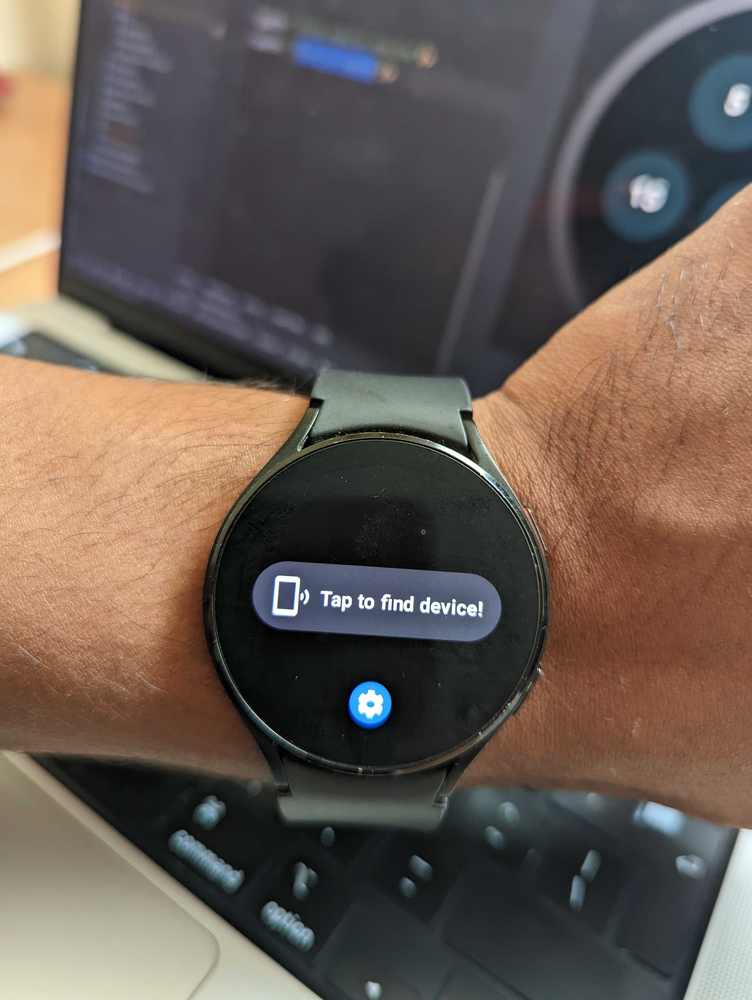
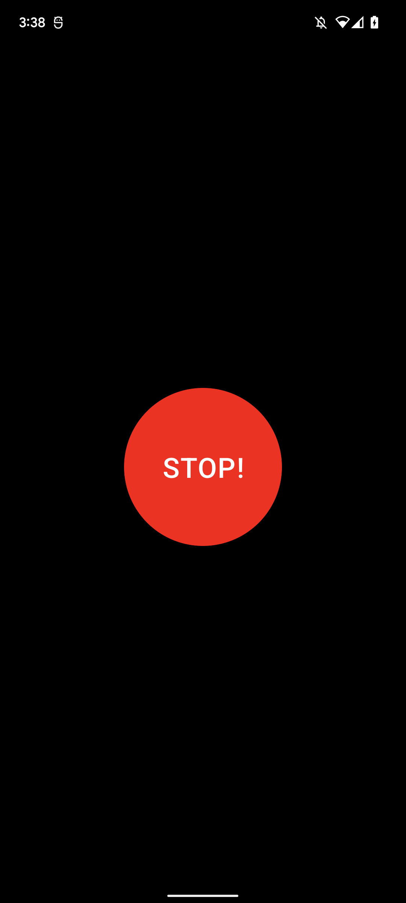

### Wear OS + Mobile App , the propose is notify the App from the Wear OS app.

This project is a sample using Wear + Mobile with Jetpack Compose also share information between devices using Wearable.getClient.

#### Architecture and Libraries

On Mobile
* Kotlin Language <3 ✔
* API minimum 29 and target 33 ✔
* Jetpack Compose ✔

On Wear
* Kotlin Language <3 ✔
* API minimum 30 and target 33 ✔
* Jetpack Compose ✔

# Screenshot
- Wear
  

- Mobile
  
